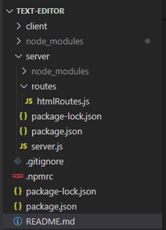
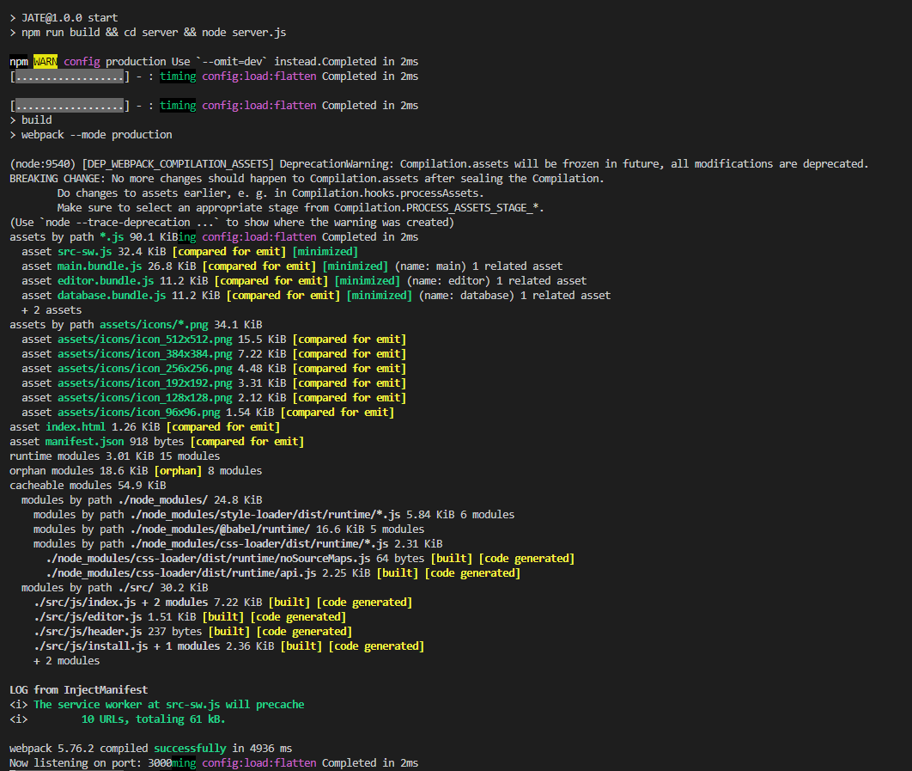
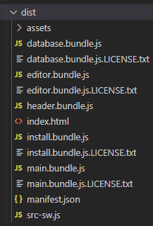
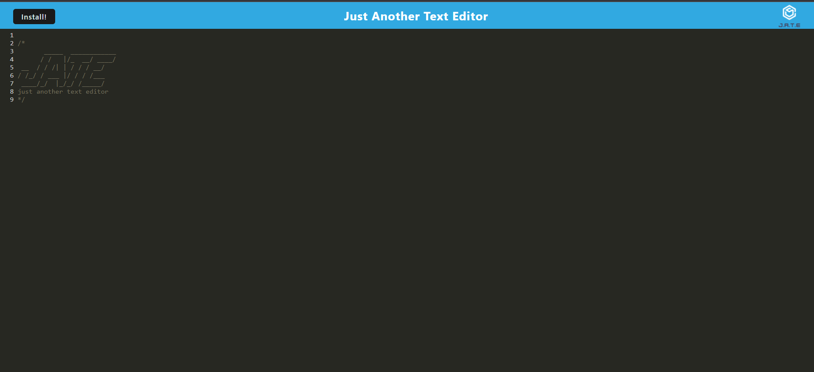
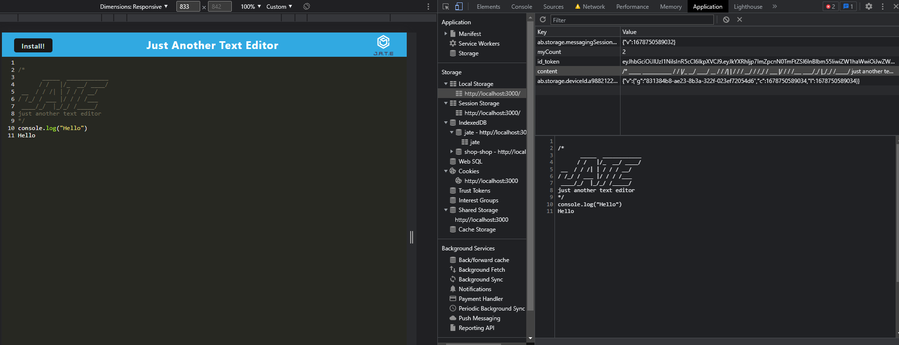
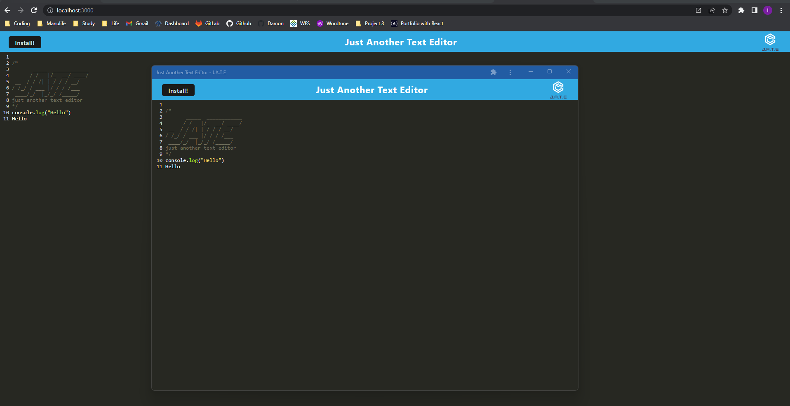
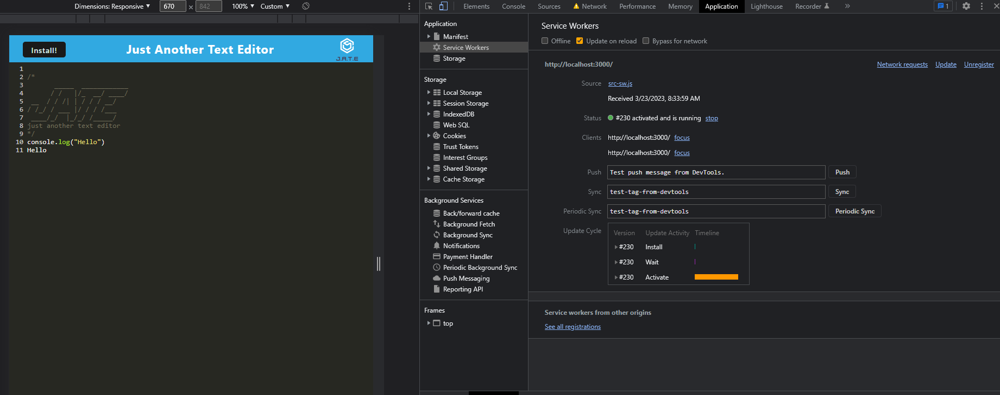
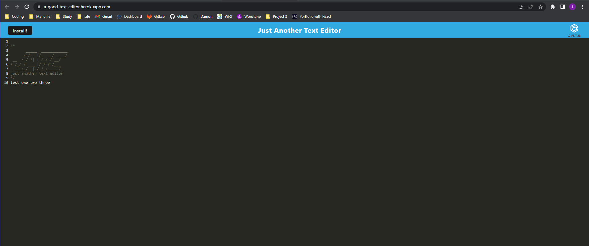

# Text Editor

## Description
This application is a text editor that runs in the browser. The app will be a single-page application that meets the PWA criteria. Additionally, it will feature a number of data persistence techniques that serve as redundancy in case one of the options is not supported by the browser. The application will also function offline.

## Table of Contents
  * [User Story](#user-story)
  * [Installation](#installation)
  * [Heroku Link](#heroku-link)
  * [Application Screenshot](#application-screenshot)
  * [Questions](#questions)  

## User Story
```md
AS A developer
I WANT to create notes or code snippets with or without an internet connection
SO THAT I can reliably retrieve them for later use
```

## Installation
- Install required node pacakges by running:
    ```
    npm run install
    ```

## Heroku Link
This application is deployed to [Heroku](https://a-good-text-editor.herokuapp.com/)

## Application Screenshot
- WHEN I open my application in my editor, THEN I see a client server folder structure.


- WHEN I run `npm run start` from the root directory, THEN I find that my application should start up the backend and serve the client. </br>
WHEN I run the text editor application from my terminal, THEN I find that my JavaScript files have been bundled using webpack. </br>
WHEN I run my webpack plugins, THEN I find that I have a generated HTML file, service worker, and a manifest file. </br>


- Here is the screenshot of the generated HTML, service worker and a manifest file.


- WHEN I use next-gen JavaScript in my application, THEN I find that the text editor still functions in the browser without errors.


- WHEN I open the text editor, THEN I find that IndexedDB has immediately created a database storage.</br>
WHEN I enter content and subsequently click off of the DOM window, THEN I find that the content in the text editor has been saved with IndexedDB.</br>
WHEN I reopen the text editor after closing it, THEN I find that the content in the text editor has been retrieved from our IndexedDB.</br>


- WHEN I click on the Install button, THEN I download my web application as an icon on my desktop.


- WHEN I load my web application, THEN I should have a registered service worker using workbox. </br>
WHEN I register a service worker, THEN I should have my static assets pre cached upon loading along with subsequent pages and static assets.


- WHEN I deploy to Heroku, THEN I should have proper build scripts for a webpack application.


## Questions
If you have any questions, you can find [my Github](https://github.com/PennyLIU2022) and reach me by email at: pennyliu806@gmail.com